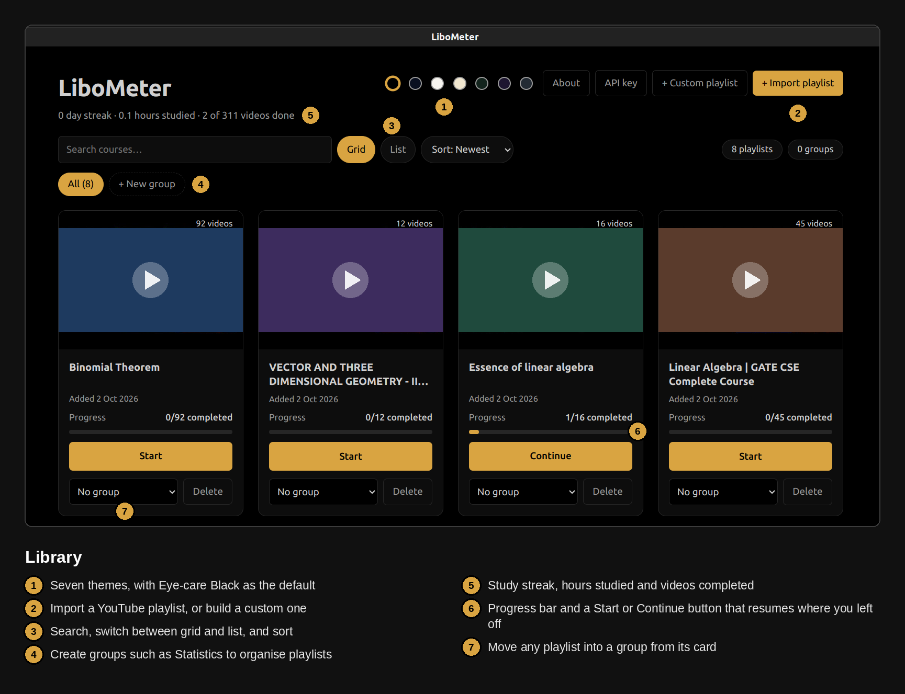
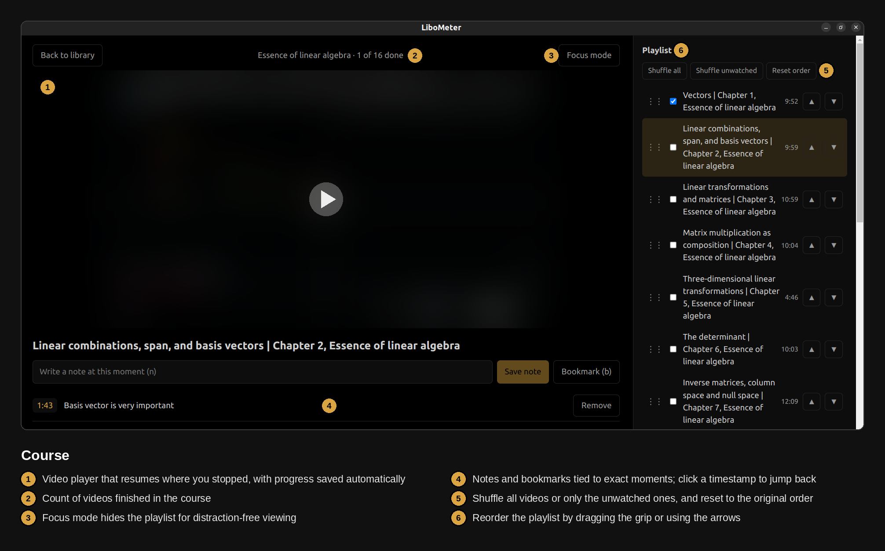
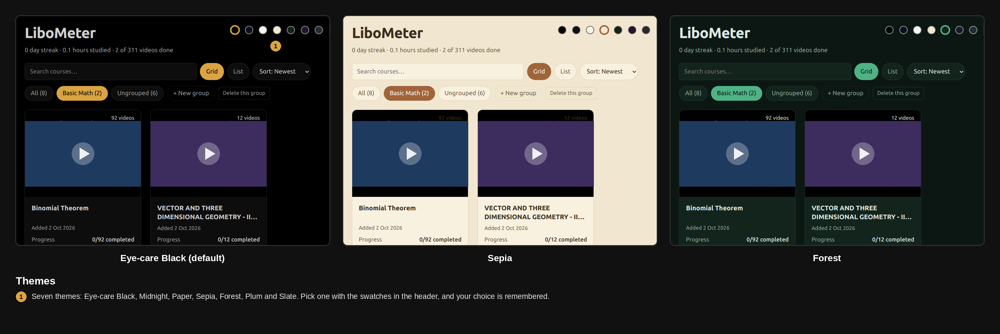
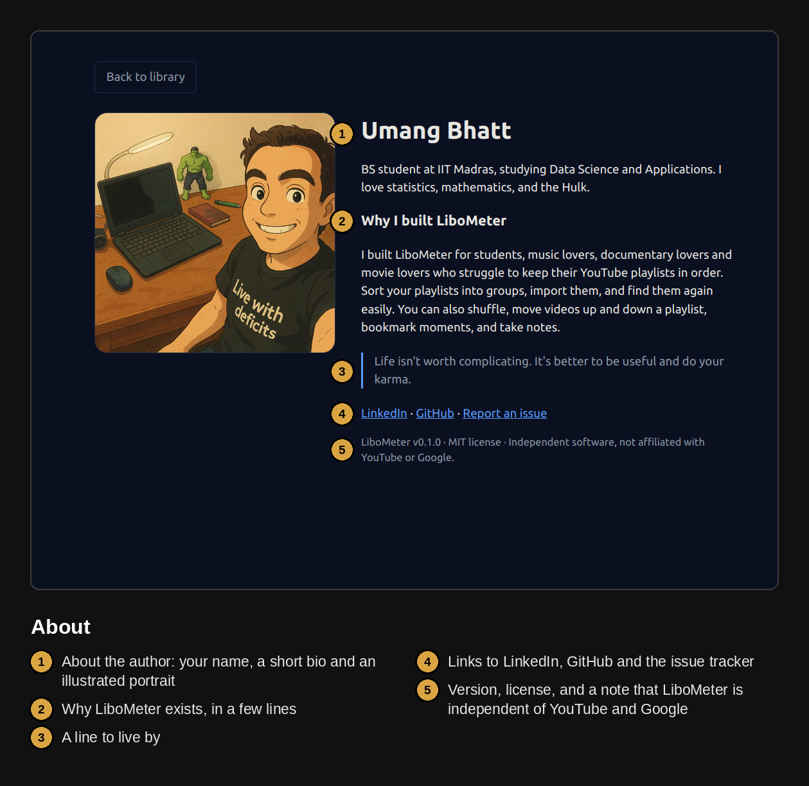
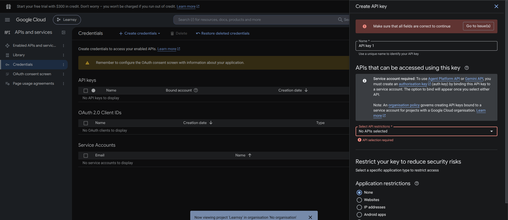
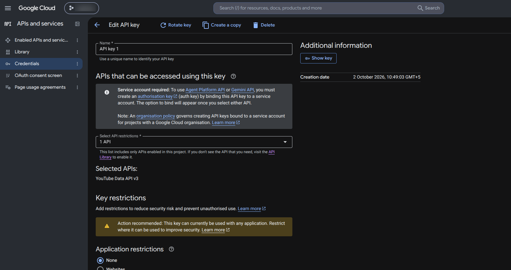

# LiboMeter
Inspired by [learnsy](_https://learnsy.vercel.app/) 

Turn YouTube playlists into courses you can track. LiboMeter is a desktop app that keeps everything on your own computer.

- Import any public or unlisted playlist as a course
- Track which videos you've finished and resume where you left off
- Take notes and bookmarks tied to exact moments in a video
- Organise playlists into your own groups (for example "Statistics")
- See your study streak and hours

Videos play through YouTube's official embedded player. LiboMeter never downloads videos.

## Screenshots









## Install (Linux)

1. Download the `.AppImage` file from the [Releases](../../releases) page.
2. Make it runnable, then start it:

   ```bash
   chmod +x LiboMeter-*.AppImage
   ./LiboMeter-*.AppImage
   ```

3. If you see an error about `libfuse.so.2`, run `sudo apt install libfuse2` and try again.

Prefer a regular install? Download the `libometer_*_amd64.deb` file instead and run `sudo dpkg -i libometer_*_amd64.deb`. LiboMeter then appears in your applications menu.

## Get a free YouTube API key

LiboMeter reads playlist titles and video lengths from YouTube, and YouTube requires a key for that. The key is free, needs no credit card, and takes about five minutes to create. You only do this once.

Your key is stored on your computer and is sent only to Google.

### Step 1: Sign in to Google Cloud

Go to [console.cloud.google.com](https://console.cloud.google.com) and sign in with any Google account. Accept the terms if asked. You can ignore any "free trial" banner, because you don't need billing.

### Step 2: Create a project

1. Click the project selector at the top of the page (next to the Google Cloud logo).
2. Click **New Project**.
3. Name it `LiboMeter`. Leave **Location** as it is.
4. Click **Create**, then make sure "LiboMeter" is the selected project at the top.

### Step 3: Turn on the YouTube API

1. Open the left menu and go to **APIs & Services**, then **Library**.
2. Search for **YouTube Data API v3** and open it.
3. Click **Enable**.

### Step 4: Create the key



After creating the key, its page looks like this. Click **Show key** to reveal and copy it.


1. Go to **APIs & Services**, then **Credentials**.
2. Click **Create credentials**, then **API key**.
3. In the panel that opens:
   - Leave the name as it is, or call it `LiboMeter`.
   - Under **Select API restrictions**, choose **YouTube Data API v3** and click **OK**.
   - Leave **Application restrictions** on **None**.
4. Click **Create**.
5. Copy the key shown. It starts with `AIza`.

Ignore any message about an "OAuth consent screen". API keys don't need one.

### Step 5: Give the key to LiboMeter

1. Open LiboMeter and click **API key** at the top right.
2. Paste the key and click **Save key**.
3. Click **+ Import playlist**, paste a playlist link, and import it.

### Keep your key private
Treat the key like a password. Don't post it online, put it in screenshots, or upload it to GitHub. If it ever leaks, open **Credentials**, delete it, and create a new one. Because you restricted it to the YouTube Data API, the worst a leak can do is use up your free daily allowance.

### If something goes wrong

| Message or problem | What to do |
| --- | --- |
| "API key not valid" | The key was copied incompletely. Copy it again with no spaces, or create a new one. |
| "YouTube Data API v3 has not been used in project…" | Step 3 was skipped or done in a different project. Enable the API in the same project the key belongs to. |
| "Playlist not found" | The playlist is private or the link is wrong. Make it public or unlisted. |
| "Quota exceeded" | You've used the free daily allowance. It resets each day. Importing a playlist uses very little, so this is rare. |
| A new key doesn't work yet | Wait a minute or two and try again. |

## Using LiboMeter

- **Groups:** click **+ New group**, name it, then import playlists while that group is selected. To move an existing playlist, use the group menu on its card.
- **Reorder:** drag the grip beside a video, or use the arrows; **Reset order** restores the original.
- **Shuffle:** shuffle all videos or only the unwatched ones.
- **Custom playlists:** create one, then paste video links to add videos.
- **Themes:** pick one of seven from the swatches at the top, including Eye-care Black (default).
- **Notes:** press `n` to write a note at the current moment, or `b` to bookmark it. Click a timestamp to jump back.
- **Shortcuts:** `n` note, `b` bookmark, `f` focus mode, `Alt+←` / `Alt+→` previous and next video. They work when the video itself isn't focused.

## Run from source

You need Node.js 18 or newer.

```bash
npm install
npm run dev        # development
npm run dist       # build installers into ./release
```

## Notes

- Your data is a single SQLite file in your user data folder. Back it up by copying it.
- LiboMeter is independent software, inspired by learnsy.vercel.app. It is not affiliated with YouTube or Google.
